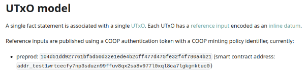
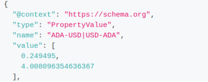

# How to implement a validator for a decentralized oracle?
The Marlowe Oracle Service includes the on-chain code for the decentralized oracles Charli3 and Orcfax, but the implementation is designed to be as generic as possible, making it easy to create new validators for new feeds or oracles. This is possible thanks to a clear separation between the validations and the lookup and parsing of the feed UTxO, we can reuse most of the validation functions and only implement new ones specific to the lookup and parsing of the new oracle’s UTxO. This guide will briefly demonstrate how to implement a new validator for a new oracle or feed, assuming the Orcfax bridge validator doesn’t exist, and implementing it following Charli3 as an example.

Some knowledge about the Cardano blockchain and the EUTxO model will be necessary, and knowledge about Aiken and Typescript will also be helpful.

Before going into the implementation of a new validator, we must understand what the [validator](https://github.com/marlowe-contrib/marlowe-oracle-service/blob/main/docs/design.md#33-oracle-bridge-validator) does. So, let’s quickly revise the checks that the validator performs.
If the redeemer is True we want to check that the transaction is correctly built and the feed is used accurately too, so we run the following validations:
- The datum of the continuing output doesn’t change
- The value of the continuing output doesn’t change
- Exactly one non-ada token is present at the bridge script UTxO. (It is assumed to be the role token)
- Exactly one oracle feed UTxO is included as a reference input
- There is exactly one Marlowe contract at the inputs
- The Marlowe contract has the corresponding thread token
- The Marlowe contract has a redeemer that resolves a choice action with the following format:
    - The choice name matches the Oracle feed name
    - The choice owner is a role token and matches the role token at the bridge UTxO
    - The choice value matches the oracle value

On the other hand, if the redeemer is False it means that we want to destroy the bridge UTxO to retrieve any ADA locked and burn the role token. Then these validations are run:
- The pubkey hash contained in the datum is signing the transaction
- No marlowe contract input is present
- All non-ada tokens in the bridge UTxO are burnt

## Common code between validators.
As we previously mentioned, most of the verifications that the validator does are performed by functions that were specifically designed to be agnostic of any oracle, as much as possible.
So, the main validator function for our new validator (the one with the validator keyword) will remain mostly the same as the one for Charli3. In the validators/bridge.ak file, let’s add what could be seen as the boilerplate for the new validator:

```aiken
validator(
  marlowe_address: Address,
  . . . , // complete here
  choice_name: ByteArray,
) {
  fn orcfax_bridge(
    datum: BridgeDatum,
    redeemer: Bool,
    ctx: ScriptContext,
  ) -> Bool {
    let opt_marlowe = lookup_and_check_marlowe(marlowe_address, ctx)
    if redeemer {
      expect Some((input_marlowe, redeemer_marlowe)) = opt_marlowe
      expect Some((input_bridge, output_bridge, tn_role_token, thread_token)) =
        lookup_and_check_bridge(ctx)
      let feed =
        lookup_orcfax_feed(
          orcfax_address,
          . . . , // complete here
          ctx,
        )

      let choice_value_dict: ChoiceDict = // complete here

      let cb = check_bridge_utxo(input_bridge, output_bridge)
      let ctt = check_marlowe_has_thread_token(input_marlowe, thread_token)
      let cc = check_choice(tn_role_token, choice_value_dict, redeemer_marlowe)

      cb? && ctt? && cc?
    } else {
      expect None = opt_marlowe
      check_bridge_destroy_utxo(datum, ctx)?
    }
  }
}
```

This code is almost the same as the validator for Charli3 except for a few missing lines and definitions, highlighted by the complete here text.

## Code specific to the oracle.
Now, let’s complete the code from the previous section. We can see that there are a couple of parts missing: some parameters, and the definition of the `feed` and `choice_value_dict` variables.

### Defining the parameters
The parameters missing are the ones related to the Oracle and the information we need for the lookup of the oracle feed UTxO within the reference inputs. These parameters may vary but it will generally be an address, and the asset class (or the Policy Id) of an NFT identifying the oracle feed. To complete them, we must study the oracle in question.
Continuing with our example, we can see on Orcfax’s documentation that we will need to use an address and a PolicyId, in contrast with Charli3 which provides a whole Asset Class.


In this case the datum also specifies the name of the exchange rate it informs, we might want to include that expected name in our parameters to make sure we’ve got the right reference input, and not one for another feed.



Other interesting details we might note in the documentation are the fact that it has an inline datum (which will be useful when decoding the datum), and that it informs two feeds, instead of just one. What does this mean for our implementation? That we will have two possible choice names for a single oracle, and that our lookup function will possibly need to return two feeds.
Then, our validator’s parameters will look like this:
https://github.com/marlowe-contrib/marlowe-oracle-service/blob/9970c85e43b4e771a232a16db11a69d4e1975377/on-chain-bridge/validators/bridge.ak#L56-L62

### Lookup of the Oracle reference input.
Having defined the parameters, we can move on to implementing the `lookup_orcfax_feed` function. This function is responsible for finding the oracle’s UTxO among the reference inputs, verifying that it is only one and returning the feed (or feeds) that it informs. This function could also check for other qualities according to the information that the oracle provides, like a creation and expiration date. The implementation of this function will most likely include the definition of new types that will allow us to parse things like the datum easily.

For example with Orcfax, the lookup function will:
- find the Orcfax reference input, using the Address from the parameters and make sure that it is exactly one
- check that the transaction’s validity interval falls within the validity interval of the orcfax feed
- check that the name for the exchange rate in the datum is the same as the one provided as a parameter.
Or fail if some of these conditions aren’t met.

In a new file named [orcfax.ak](../on-chain-bridge/lib/oracles/orcfax.ak) in the `lib/oracles` folder, let’s define the function:
https://github.com/marlowe-contrib/marlowe-oracle-service/blob/9970c85e43b4e771a232a16db11a69d4e1975377/on-chain-bridge/lib/oracles/orcfax.ak#L204-L235
It uses some utility functions and new types, the complete implementation can be seen in the [lib/oracles/orcfax.ak](../on-chain-bridge/lib/oracles/orcfax.ak) file.

### Definition of the `choice_value_dict`.
The definition of the `choice_value_dict` variable is the last one left. As you may have noticed, this variable will be used in the `check_choice` function, which checks that the values informed in the redeemer for the Marlowe script are the same as the values found in the datum of the oracle feed UTxO.
The definition of this variable is simply a dictionary of the choice names and their corresponding feed values found in the oracle feed UTxO, and it varies according to the number of feeds informed by the oracle. For example, Charli3 informs only one feed, and Orcfax informs two.
Finishing the Orcfax example, since we have two choice names because we have two feeds, the variable will look like this:
https://github.com/marlowe-contrib/marlowe-oracle-service/blob/9970c85e43b4e771a232a16db11a69d4e1975377/on-chain-bridge/validators/bridge.ak#L82-L93
In this case that we have more than one feed it is important to not mix up the choice names and the feed values because that will result in the validation failing.

## Compiling the validator.
Let's see what the comple validator function looks like:
https://github.com/marlowe-contrib/marlowe-oracle-service/blob/9970c85e43b4e771a232a16db11a69d4e1975377/on-chain-bridge/validators/bridge.ak#L56-L105

If we didn’t make any mistakes we should be able to run
```bash
 aiken build
```
successfully, and we are ready to deploy the validator.

We provide a utility script to deploy validators, and you can find the instructions to use it in the [README.md](../README.md).

